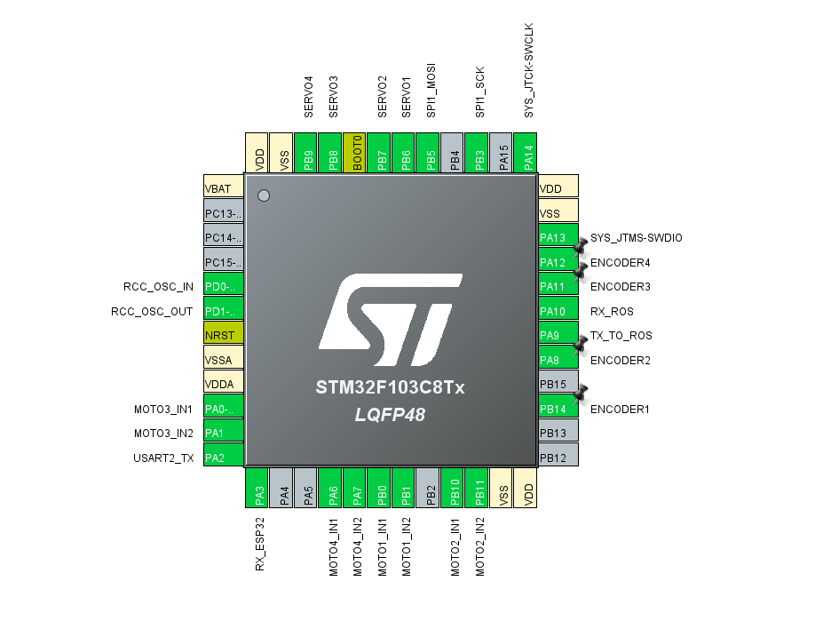

# 大秦科技——RIC机器人电控技术文档

[TOC]


## 一、简介

本文档针对该项目的各个重点模块进行简要介绍，涵盖机器人底盘控制、机械臂控制、Xbox控制器数据包接收等方面。

## 二、引脚配置


<center>图1 引脚配置图</center>


## 三、采用C/C++混合编写

基于C++类的特性，封装了remote_control、Servos、chassis、motor多个类的成员变量和成员函数。

类相较于结构体可设置成员变量的访问权限，让成员变量不被随意访问和修改（虽然没有怎么用上这个特性）；类相较于结构体另一个突出的特点是可以封装成员函数，相当于结构体Pro Max,利用好这个特性调用类中成员函数在编写代码时非常方便，例如：

```c++
		Mec_Chassis.mec_chassis_wheel_speed();
		for (uint8_t i = 0; i < 4; i++)
		{

			motors[i].wheel_linear_speed_to_rpm(i);
			motors[i].motor_pwm_tx(i);
		}
```

这样可以非常方便的访问底盘和电机的相关成员函数，从而控制电机转速。

### 让keil5支持C++

1. 点开魔术棒，选择target,编译器选择AC6:


<center>图3 编译器选择图</center>

2. 点击C/C++(AC6),为方便调试可以选择-O0优化等级，C和C++的标准可以根据需求选择：


<center>图4 编译优化选项图</center>

3. 最后添加自己的cpp和h文件即可，更多信息可以参考:

   [STM32 C++编程系列一：STM32 C++编程介绍_c++ stm32-CSDN博客](https://blog.csdn.net/qq_31562655/article/details/121024971?spm=1001.2014.3001.5506)

## 四、底盘控制

### 1.采用外部中断捕获编码器脉冲

由于需要同时控制四个编码器电机而STM32f103C8T6计时器资源不够，故采用外部中断方式捕获编码器脉冲，STM32CubeMX配置如下：

1. 每一个电机编码器可只需接一个相（主要是主板引脚接口已经定型，不好再改引脚，AB相都接着更好，采样精度更高还可以得到真实方向），采用上升沿和下降沿触发，提高采样精度：


<center>图5 外部中断引脚模式配置图</center>

2. 把外部中断优先级设置到7，避免打断重要的中断：


<center>图6 外部中断优先级配置图</center>

3. 最后编写回调函数记录中断数，我使用了一个宏定义说明该函数意义：

```c
/**
 * ************************************************************************
 * @brief 编码器脉冲记录 Encoder pulses recording
 *
 *
 * ************************************************************************
 */
void ENCODER_OUTPUT()
{
    switch (GPIO_Pin)
    {
    case ENCODER1_Pin:

        motors[0].Encoder_Count();
        break;
   case ENCODER2_Pin:

       motors[1].Encoder_Count();
       break;
    case ENCODER3_Pin:

        motors[2].Encoder_Count();
        break;
    case ENCODER4_Pin:

        motors[3].Encoder_Count();
        break;
    default:
        break;
    }
}

```

(PS:我还测试过LL库的外部中断，外部中断可以触发而且在高频率触发条件下效率比HAL库高，但是无法计数，可能还存在问题)

### 2.卡尔曼滤波处理电机转速

对于电机转速，我采用的是M法测速，但由于编码器测速得到的速度值是离散的，如果电机的速度值刚好卡在两个离散值中间，我们测得的速度值就会在这两个离散值中间来回震荡。为改善此现象，我决定采用卡尔曼滤波处理电机转速，经过多次调参终于达到一个比较理想的速度曲线，这里贴上卡尔曼滤波函数代码：

```c
/**
 *@brief  卡尔曼滤波器
 *@param kfp 卡尔曼结构体参数
 *@param input 需要滤波的参数的测量值（即传感器的采集值）
 *@return 滤波后的参数（最优值）
 */
float kalman_filter(kalman *kfp, float input)
{
    // 预测协方差方程：k时刻系统估算协方差 = k-1时刻的系统协方差 + 过程噪声协方差
    kfp->Now_P = kfp->Last_P + kfp->Q;
    // 卡尔曼增益方程：卡尔曼增益 = k时刻系统估算协方差 / （k时刻系统估算协方差 + 观测噪声协方差）
    kfp->Kg = kfp->Now_P / (kfp->Now_P + kfp->R);
    // 更新最优值方程：k时刻状态变量的最优值 = 状态变量的预测值 + 卡尔曼增益 * （测量值 - 状态变量的预测值）
    kfp->out = kfp->out + kfp->Kg * (input - kfp->out); // 因为这一次的预测值就是上一次的输出值
    // 更新协方差方程: 本次的系统协方差付给 kfp->LastP 威下一次运算准备。
    kfp->Last_P = (1 - kfp->Kg) * kfp->Now_P;
    return kfp->out;
}
```


### 3.PID自适应P系数

为更灵活地调节控制电机转速，我采用了自调节P系数，根据误差值灵活调节p的大小：

```c
 // 自适应Kp调节 auto control Kp
    if (pid->k1 != 0 || pid->k2 != 0 || pid->k3 != 0)
    {
        pid->p = pid->k1 * log10f(pid->k2 * ABS(pid->err[NOW]) + pid->k3);
    }
    else
    {
        // Calculate the proportional component
        pid->pout = pid->p * pid->err[NOW];
    }
    
```


## 五、数据包接收解析

### 1.串口空闲中断+DMA接收

采用串口空闲中断+DMA接收数据包，减少CPU的负担，避免重要任务被打断。

## 六、机械臂控制

### 1.一键控制

