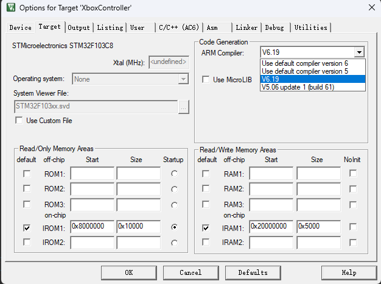
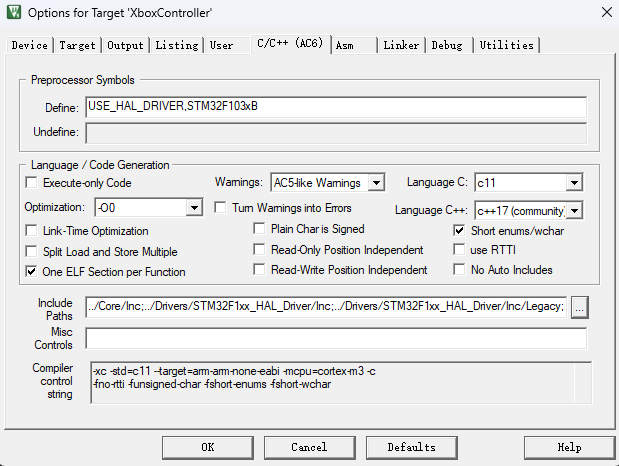
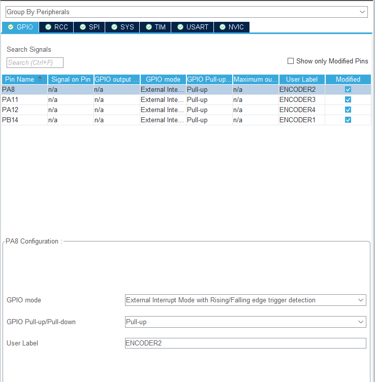
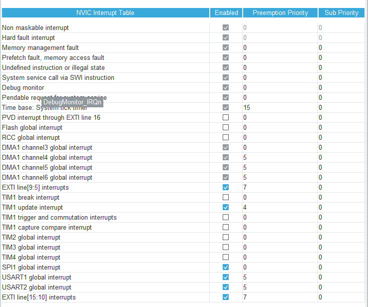

# 大秦科技——RIC机器人电控技术文档


[TOC]


## 一、简介

本文档针对该项目的各个重点模块进行简要介绍，涵盖机器人底盘控制、机械臂控制、Xbox控制器数据包接收等方面。

## 二、引脚配置


<center>图1 引脚配置图</center>


## 三、采用C/C++混合编写

### 1.让keil5支持C++

1. 点开魔术棒，选择target,编译器选择AC6:



<center>图3 编译器选择图</center>

2. 点击C/C++(AC6),为方便调试可以选择-O0优化等级，C和C++的标准可以根据需求选择：



<center>图4 编译优化选项图</center>

3. 最后添加自己的cpp和h文件即可，更多信息可以参考:

   [STM32 C++编程系列一：STM32 C++编程介绍_c++ stm32-CSDN博客](https://blog.csdn.net/qq_31562655/article/details/121024971?spm=1001.2014.3001.5506)
   
### 2.使用类进行封装

   基于C++类的特性，封装了remote_control、Servos、chassis、motor多个类的成员变量和成员函数。

   类相较于结构体可设置成员变量的访问权限，让成员变量不被随意访问和修改；类相较于结构体另一个突出的特点是可以封装成员函数，相当于结构体Pro Max,利用好这个特性调用类中成员函数在编写代码时非常方便，例如：

   ```c++
   		Mec_Chassis.mec_chassis_wheel_speed();
   		for (uint8_t i = 0; i < 4; i++)
   		{
   
   			motors[i].wheel_linear_speed_to_rpm(i);
   			motors[i].motor_pwm_tx(i);
   		}
   ```

   这样可以非常方便的访问底盘和电机的相关成员函数，从而控制电机转速。

### 3. 使用自定义命名空间

   

## 四、底盘控制

### 1.采用外部中断捕获编码器脉冲

由于需要同时控制四个编码器电机而STM32f103C8T6计时器资源不够，故采用外部中断方式捕获编码器脉冲，STM32CubeMX配置如下：

1. 每一个电机编码器可只需接一个相（主要是主板引脚接口已经定型，不好再改引脚，AB相都接着更好，采样精度更高还可以得到真实方向），采用上升沿和下降沿触发，提高采样精度：



<center>图5 外部中断引脚模式配置图</center>

2. 把外部中断优先级设置到7，避免打断重要的中断：



<center>图6 外部中断优先级配置图</center>

3. 最后编写回调函数记录中断数，我使用了一个宏定义说明该函数意义：

```c
/**
 * ************************************************************************
 * @brief 编码器脉冲记录 Encoder pulses recording
 *
 *
 * ************************************************************************
 */
void ENCODER_OUTPUT()
{
    switch (GPIO_Pin)
    {
    case ENCODER1_Pin:

        motors[0].Encoder_Count();
        break;
   case ENCODER2_Pin:

       motors[1].Encoder_Count();
       break;
    case ENCODER3_Pin:

        motors[2].Encoder_Count();
        break;
    case ENCODER4_Pin:

        motors[3].Encoder_Count();
        break;
    default:
        break;
    }
}

```

(PS:我还测试过LL库的外部中断，外部中断可以触发而且在高频率触发条件下效率比HAL库高，但是无法计数，可能还存在问题)

### 2.卡尔曼滤波处理电机转速

对于电机转速，我采用的是M法测速，但由于编码器测速得到的速度值是离散的，如果电机的速度值刚好卡在两个离散值中间，我们测得的速度值就会在这两个离散值中间来回震荡。为改善此现象，我决定采用卡尔曼滤波处理电机转速，经过多次调参终于达到一个比较理想的速度曲线，这里贴上卡尔曼滤波函数代码：

```c
/**
 *@brief  卡尔曼滤波器
 *@param kfp 卡尔曼结构体参数
 *@param input 需要滤波的参数的测量值（即传感器的采集值）
 *@return 滤波后的参数（最优值）
 */
float kalman_filter(kalman *kfp, float input)
{
    // 预测协方差方程：k时刻系统估算协方差 = k-1时刻的系统协方差 + 过程噪声协方差
    kfp->Now_P = kfp->Last_P + kfp->Q;
    // 卡尔曼增益方程：卡尔曼增益 = k时刻系统估算协方差 / （k时刻系统估算协方差 + 观测噪声协方差）
    kfp->Kg = kfp->Now_P / (kfp->Now_P + kfp->R);
    // 更新最优值方程：k时刻状态变量的最优值 = 状态变量的预测值 + 卡尔曼增益 * （测量值 - 状态变量的预测值）
    kfp->out = kfp->out + kfp->Kg * (input - kfp->out); // 因为这一次的预测值就是上一次的输出值
    // 更新协方差方程: 本次的系统协方差付给 kfp->LastP 威下一次运算准备。
    kfp->Last_P = (1 - kfp->Kg) * kfp->Now_P;
    return kfp->out;
}
```


### 3.PID自适应P系数

为更灵活地调节控制电机转速，我采用了自调节P系数，根据误差值灵活调节p的大小：

```c
    // 自适应Kp调节 auto control Kp
    if (pid->k1 != 0 || pid->k2 != 0 || pid->k3 != 0)
    {
        pid->p = pid->k1 * log10f(pid->k2 * ABS(pid->err[NOW]) + pid->k3);
    }
    
    
        // Calculate the proportional component
        pid->pout = pid->p * pid->err[NOW];
    
    
```


## 五、数据包接收解析

### 1.串口空闲中断+DMA接收

采用串口空闲中断+DMA接收数据包，减少CPU的负担，避免重要任务被打断。

```c
// The length of one frame of data received
// 接收一帧数据的长度
volatile uint8_t rx_len = 0;
// A frame of data reception completion flag
// 一帧数据接收完成标志
volatile uint8_t recv_end_flag = 0;
// Define the serial port receiving buffer
//  定义串口接收缓存区
uint8_t rx_buffer[BUF_SIZE] = {0};

/**
 * ************************************************************************
 * @brief 打开串口空闲中断，DMA接收
 * 
 * 
 * ************************************************************************
 */
void My_USART2_Init(void)
{
	// 不加收不到数据
	__HAL_UART_ENABLE_IT(&huart2, UART_IT_IDLE);
	HAL_UART_Receive_DMA(&huart2, rx_buffer, BUF_SIZE);
}

/**
 * @brief This function handles USART2 global interrupt.
 */
void USART2_IRQHandler(void)
{

	uint32_t tmp_flag = 0;
	uint32_t temp;

	// Get the IDLE flag bit
	tmp_flag = __HAL_UART_GET_FLAG(&c_huart, UART_FLAG_IDLE);

	if (tmp_flag != RESET)
	{

		// Clear the status register (SR)
		temp = c_huart.Instance->SR;

		// Read data from DR (Data Register)
		temp = c_huart.Instance->DR;

		HAL_UART_DMAStop(&c_huart); // Stop DMA transfer

		// Get the number of untransmitted data in DMA
		temp = c_dma.Instance->CNDTR;

		// Calculate the number of received data by subtracting the total count from the untransmitted data count
		rx_len = BUF_SIZE - temp;

		// Set the receive completion flag to 1
		recv_end_flag = 1;
	}

	HAL_UART_IRQHandler(&c_huart);
}

```

为了方便阅读和移植，中断服务函数可等效于：

```c
void USART2_IRQHandler(void)
{

	uint32_t tmp_flag = 0;
	uint32_t temp;

	// Get the IDLE flag bit
	tmp_flag = __HAL_UART_GET_FLAG(&c_huart, UART_FLAG_IDLE);
	//tmp_flag = (((&c_huart)->Instance->SR & (UART_FLAG_IDLE)) == (UART_FLAG_IDLE));

	if (tmp_flag != RESET)
	{

		__HAL_UART_CLEAR_IDLEFLAG(&c_huart); // 清除标志位 clear IDLE flag
		// // Clear the status register (SR)
		// temp = c_huart.Instance->SR;

		// // Read data from DR (Data Register)
		// temp = c_huart.Instance->DR;

		HAL_UART_DMAStop(&c_huart); // Stop DMA transfer

		// Get the number of untransmitted data in DMA
		temp = __HAL_DMA_GET_COUNTER(&c_dma);
		//temp = c_dma.Instance->CNDTR;

		// Calculate the number of received data by subtracting the total count from the untransmitted data count
		rx_len = BUF_SIZE - temp;

		// Set the receive completion flag to 1
		recv_end_flag = 1;
	}

	HAL_UART_IRQHandler(&c_huart);
}
```

### 2.与上位机通信

为了确定数据协议，我和上位机同学交流确定了类似手柄的数据协议，非常方便代码的移植。

## 六、机械臂控制

### 1.一键控制

为了更灵活地控制机械臂，我在手柄上设置了几个快捷键方便实现一键取矿、一键放入矿仓、一键复位等功能。

根据键位状态的变化，设置舵机的角度来控制机械臂，让机械臂既能快速响应又能精细调控，原理非常简单。

```c++
/**
 * ************************************************************************
 * @brief 控制机械臂
 *
 *
 * ************************************************************************
 */
inline void Control_Robotic_Arm()
{
	// 一键准备抓取/复位
	if (Xbox.Share)
	{
		Servo[0].Control_Servo(120);
		Servo[1].Control_Servo(44);
		Servo[2].Control_Servo(74);
	}
	// 一键云台复位
	if (Xbox.X)
	{
		Servo[1].Control_Servo(44);
		Servo[0].Control_Servo(120);
	}
	// 一键云台右摆
	if (Xbox.B)
	{
		Servo[1].Control_Servo(44);
		Servo[0].Control_Servo(33);
	}
	// 一键放入矿仓
	if (Xbox.Menu)
	{
		Servo[1].Control_Servo(44);
		Servo[2].Control_Servo(13);
		Servo[0].Control_Servo(30);
	}

	// 控制机械爪
	if (K_Claw == 1)
	{
		Servo[3].Control_Claw();
		K_Claw = 0;
	}
	// 控制云台
	if (K_Gimbal == 4)
	{
		Servo[0].Control_Gimbal();
		K_Gimbal = 0;
	}
	// 控制臂
	if (K_Arm == 2)
	{
		Servo[1].Control_Arm();
		K_Arm = 0;
	}
	// 控制腕
	if (K_Wrist == 1)
	{
		Servo[2].Control_Wrist();
		K_Wrist = 0;
	}
}
```


